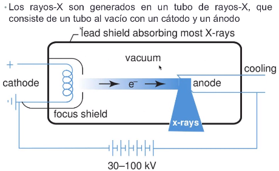

### Formación de la imagen por rayos-X

Los rayos-X fueron descubierto por Wilhelm Rontgen en 1895 mientras realizaba experimentos irradiando pantallas fluorecentes con tubos de rayos catódicos.

Las pantallas fluorecentes emitían luz incluso cuando los tubos se encontraban dentro de cajas de cartón

Los rayos-X son ondas EOM

