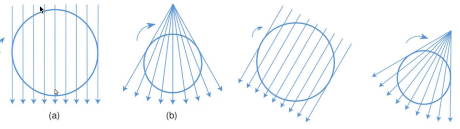
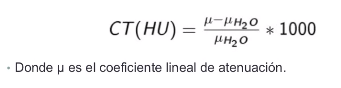
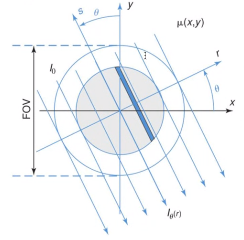
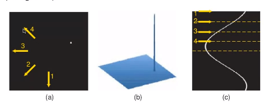
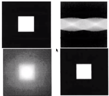

## TAC
La tomografía computarizada produce secciones transversales que describen la atenuación que genera el tejido en los rayos-X.

Un conjunto de emisiones en líneas de rayos-X

## Introducción

Los elementos básicos para la tomografía computarizada están dados por el descubrimiento de los rayos-X y por la formulación de Johann Radon que permite la reconstrucción de una señal a partir de sus proyecciones. 

Se hacen rayos-X por varias ángulos y luego se unen para formar una imagen tridimensional. Se necesita un modelo matemático. 

### Generalidades
* Los equipos de CT modernos entregan imágenes de 512*512 pixeles que representan número CT.

Con esta definición se obtiene que:
* El aire tiene un número CT de -1000, el agua de 0 y el hueso va desde los cientos hasta alrededor de 1000HU.
* Esto es debido a que el *u* del hueso, y el de otros tejidos, varía de acuerdo a la composición y estructura. 

### Visualización

Para la visualización de la tomografía se suele utilizar los operadoes de *ventana y nivel* los cuales definen el rango de grises en los cuales se visualizará la imagen. 

### Adquisición de los datos.
Considere la geometría en abanico paralelo en la siguiente figura:

En la gráfica u *(x,y)*
.
.
.

El apilamiento de todas las proyecciones genera un **Sinograma** 
- X=0
- Y=0
Y luego se apilan. 

#### Ejemplo
Sinograma para un punto.(Las fleyas son direcciones arbitrarias de proyección).
La función de proyección tiene una forma senosoidal(sinograma)

### Adquisición

**Reconstrucción: Retroprección**
* La reconstrucción de la imagen desde perfiles de proyección resultará de la aplicación inversa de la transformada de Radon.
* La absorción en cada píxel es desconocida pero cada haz paralelo entrega lo que sería la solución para un sistema de múltiples ecuaciones.
* Suelen haber más pixeles que direcciones de proyección po lo que se suelen de utilizar métodos iterativos de aproximación (retroproyección filtrada).
* Para corregir el efecto de la retroproyección sobre los pixeles circundantes a pixeles altamente obsorbentes se utiliza una combinación de filtros: *Retroproyección filtrada*

Se le hace el TC al cuadrado, se recibe la segunda imagen, luego se le hacen algortimos y filtrados para obtener la reconstrucción de la imagen real.

**Tomografía de único corte**
*TC Circular*
* La manera más directa de escanear un volumen es obteniendo cortes consecutivos mediante rotaciones de un detector alternados con pequeños.

